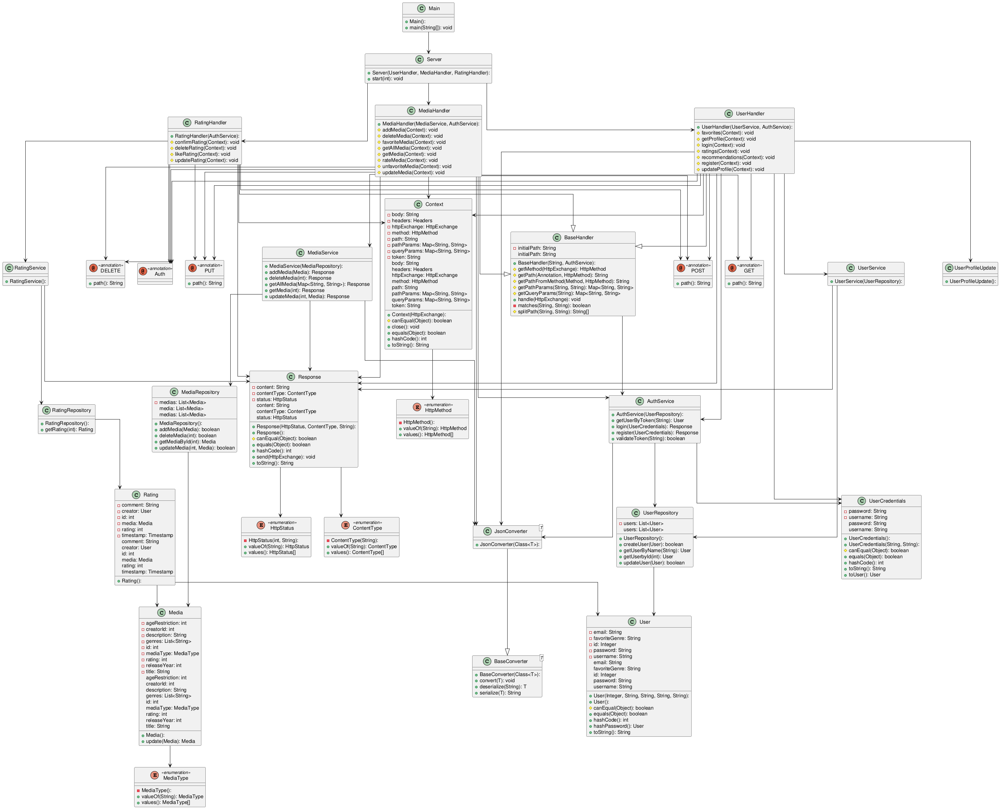

# Media Ratings Platform Protocol

Link to [Github](https://github.com/JHochstegerCLF/n-semester-project)

## Structure

The Files are separated into 5 overaching folders:

* Presentation (API definition and Routing Logic)
* Service (Logic of the application -> verification, conversion, filtering)
* Persistence (Concerned with saving of Data -> currently just a List but later DB)
* Models (All Data-objects and Enums)
* Converter (Services to serialize/deserialize)

### Presentation

The Http Server is created in Server.java there the handlers for:

* `/api/users`
* `/api/media`
* `/api/ratings`

are registered.

There are 3 different handlers:

* UserHandler
* MediaHandler
* RatingHandler

all extending the BaseHandler with holds the logic for routing to the correct method in the 3 handlers.
The handlers itself only implement the Methods and annotate them According to the HttpMethod and endpoint to which they
belong to.

Some helper classes like Context or Response where also created to simplify the transfer of data between layers.

### Service

The Service Layer holds the main business logic for the Application. anytime something needs to be validated or modified
before use it happpens in the Service layer.

### Persistence

The Persistence Layer has the single responsibility to save or retrieve data. Modification or conversion should be done
in the Service layer.

### Models

The Models Folder contains all data objects that are shared between layers. Some data objects are only used in one layer
so they are located there (e.g Context and Response are located in presenation layer)

### Converter

The Converter currently only holds one Mapper for Json but could be expanded to allow for mapping to XML and others.

## Decisions

Due to my prior experience with SpringBoot the decision was made to try and emulate the style of this framework since it
provides a simple and modifiable way of defining rest apis.

For this I looked into Annotations and created my own for the different HttpMethods and the Authentication.
The BaseHandler which all other Handlers should extend handles the logic for routing and Authentication based on the
aforementioned Annotations using reflections.
This also gives the option to output the api calls and which function was called for this endpoint for easy debugging.

Another important feature I wanted to use was Dependency Injection (DI). To make this easier I added the Guice package
which allows Injection without having to pass the instances through the entire creation chain.
This would simplify the Process of accessing other Classes/Layers and would also allow me to simply provide Singletons
for the Repositories due to the fact that they currently use a List saved in the Repository Instance.

With these design decisions the process of implementing different endpoints is very simple since you don't have to think
about Passing instances of services and a giant switch case for the different endpoints is also not needed.

## Problems

There were only a few problems during the development process.
The first one was the Design of the Router. I wasn't satisfied with creating a giant if-else block that would hold all
the methods that corresponded to each endpoint.
So I decided to move all this logic to a BaseHandler and only register the methods in a map.
But this approach had its own pitfalls, because passing through the method and having all necessary information in the
map wasn't very clear to see which endpoint was which so I switched to Annotations.
This solved all these problems and gave me a simple way to access all methods and the corresponding information.

The second problem I encountered was the dependency injection for each Handler/Service/Repository.
Since not every Class needs everything I decided to use a Library called Guice that would alleviate the need for this by
providing the injections to the corresponding classes.
This makes the code easier to read and removes the need to pass Instances through the entire code.

With this arose another problem that the instances of the Repositories, which held the Lists of Objects, weren't the
same throughout the application.
To fix this I needed to mark the Repositories with the @Singleton Annotation to tell Guice that the Instance of this
Class should always be the same.

## Time tracking

### Structuring Files

approx. 2 hours

### Router

approx. 2 Days

### Implementing routes

approx. 4 hours

### Authorisation

approx. 2 hours

## Testing

For testing I've provided 2 possible ways:

* curl-script: A simple Curl script (integrationTests.sh) that shows the registration, login and CRUD operations. The
  script was written on linux, so testing on Windows maybe in WSL
* Intellij http script: If the Curl script shouldn't work the http script from Intellij performs the same actions.

## Class Diagram

